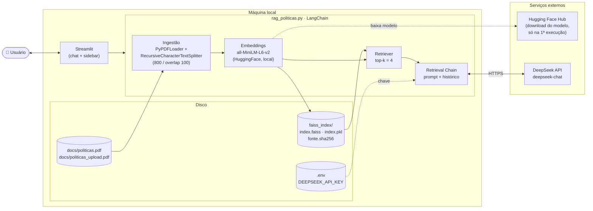
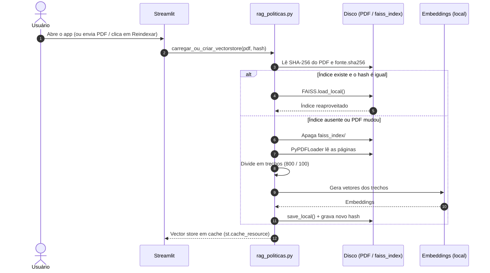
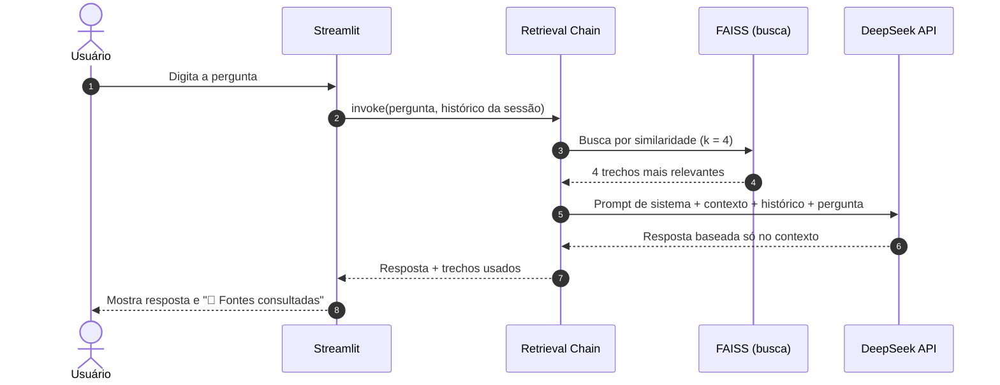

# Assistente de Políticas de RH (RAG)

> **Aviso acadêmico:** este repositório é um **exemplo didático**. Ele existe para ensinar, de forma simples e local, como funciona uma aplicação de *Retrieval-Augmented Generation* (RAG). **Não é um produto e não deve ser levado a produção como está.**

## Propósito

Na engenharia de software aplicada a dados e IA, o valor de um exemplo está em isolar o conceito. Aqui o conceito é o RAG: em vez de esperar que um modelo de linguagem "lembre" de um assunto, **recuperamos** o conhecimento relevante de uma base documental e o entregamos ao modelo como contexto, pedindo que ele responda **apenas** com base nele. O modelo passa a raciocinar sobre evidências que você controla, e não sobre o que memorizou no treinamento. Isso reduz alucinações e permite citar as fontes.

Para tornar o conceito visível, o app responde perguntas sobre políticas de RH (**férias** e **home-office**) a partir de um único PDF. Todo o pipeline cabe em um arquivo (`rag_politicas.py`) e roda na sua máquina, com poucas dependências. O objetivo é que você leia o código, o execute e entenda cada etapa: ingestão, *chunking*, *embeddings*, indexação vetorial, recuperação e geração.

## Do exemplo à produção: o que este projeto **não** cobre

Simplicidade é uma escolha pedagógica, e tem custo. Um sistema RAG corporativo precisa tratar, no mínimo, as dimensões abaixo. Este projeto **não** implementa nenhuma delas.

| Dimensão | Perguntas que um ambiente produtivo precisa responder |
| --- | --- |
| **Governança de dados** | Quem é dono de cada documento? Como versionar e aposentar políticas? Como garantir que a resposta reflete a versão vigente? Como tratar dados pessoais (LGPD)? |
| **Segurança** | Como autenticar usuários e controlar o acesso por documento (RBAC/ABAC)? Como proteger a chave da API, os segredos e o índice? Como mitigar *prompt injection* e vazamento de dados para provedores externos? |
| **Observabilidade** | Como registrar perguntas, trechos recuperados, latência, custo em tokens e erros? Como rastrear cada resposta até as suas fontes (*tracing*) e gerar auditoria? |
| **Qualidade e avaliação** | Como medir a qualidade da recuperação (*recall*, *precision*) e da resposta (fidelidade ao contexto, relevância)? Como detectar regressões com conjuntos de teste (*evals*)? |
| **Tuning e otimização** | Qual o melhor tamanho de *chunk* e de sobreposição? Vale usar busca híbrida (semântica e lexical), *reranking* ou *query rewriting*? Qual modelo de *embeddings* e de LLM atende melhor o idioma e o domínio? |
| **Escalabilidade e desempenho** | Um índice FAISS em disco atende a milhares de usuários e documentos? Quando migrar para um banco vetorial dedicado? Como usar cache e filas? |
| **Confiabilidade e custo** | Como tratar limites de taxa, *timeouts* e indisponibilidade do provedor? Como controlar gastos? Quais são os SLAs? |
| **Ciclo de vida (MLOps/LLMOps)** | Como versionar *prompts*, modelos e índices? Como automatizar a reindexação (CI/CD)? Como gerenciar a mudança de modelo sem quebrar o sistema? |
| **Conformidade e ética** | Como garantir transparência, revisão humana em decisões sensíveis e aderência às normas internas e regulatórias? |

Cada linha dessa tabela é, na prática, uma disciplina inteira. Tratar um chatbot de RH como "só um PDF e um modelo" é uma armadilha comum: o protótipo funciona na demonstração e falha diante de dados reais, usuários reais e riscos reais.

## Como usar este material

Use o repositório como **laboratório**: execute, faça perguntas que estão e que não estão no PDF, altere o tamanho dos *chunks*, troque o valor de `k`, mude o *prompt* e observe como as respostas se transformam. Cada experimento ensina algo sobre o compromisso entre recuperação e geração. Só depois de dominar o conceito vale discutir o que é necessário para levá-lo a produção.

## O que o app faz

- Você faz uma pergunta em português, como *"Quantos dias de férias posso tirar de uma vez?"*.
- O app encontra os trechos mais parecidos com a pergunta no PDF.
- O modelo de linguagem (DeepSeek) escreve a resposta usando só esses trechos.
- Abaixo de cada resposta há **📄 Fontes consultadas**, com as páginas e os trechos usados, para você conferir.
- A conversa tem memória: dá para fazer perguntas de acompanhamento ("e no caso de home-office?").

## Como funciona

```text
PDF ──► divide em trechos ──► gera embeddings ──► índice FAISS (salvo em disco)
                                                        │
pergunta ──► busca os 4 trechos mais parecidos ◄────────┘
                    │
                    ▼
        DeepSeek responde só com esses trechos
```

- **Leitura e divisão:** o PDF é lido e quebrado em trechos de 800 caracteres (100 de sobreposição).
- **Embeddings:** cada trecho vira um vetor numérico com o modelo local `sentence-transformers/all-MiniLM-L6-v2`. Ele roda na sua máquina e é baixado automaticamente na primeira execução.
- **Índice:** os vetores ficam no FAISS, em `faiss_index/`. Na primeira execução o PDF é indexado e depois o índice é reaproveitado. Se o PDF mudar, o app detecta e reindexa sozinho.
- **Resposta:** os 4 trechos mais relevantes e o histórico da conversa vão para o modelo `deepseek-chat` (via API).

## Arquitetura

### Visão geral dos componentes



### Fluxo 1 — Indexação (uma vez por PDF)



### Fluxo 2 — Pergunta e resposta (a cada mensagem)



### Decisões de arquitetura

| Decisão | Motivo | Consequência |
| --- | --- | --- |
| **Embeddings locais** (MiniLM) | Os documentos não saem da máquina na indexação e não há custo por embedding | Só o texto da pergunta e os trechos recuperados vão para a API do LLM |
| **FAISS em disco** | Simples, sem servidor de banco vetorial | Não escala para muitos usuários ou documentos; indicado para uso individual ou demonstração |
| **Hash SHA-256 do PDF** | Detecta troca de PDF e reindexa sem intervenção | Um único documento ativo por vez |
| **`temperature=0` + prompt restritivo** | Respostas determinísticas e ancoradas no contexto, com mensagem padrão quando não há resposta | Reduz alucinação, mas a qualidade depende do PDF e da busca |
| **Histórico só em `st.session_state`** | Mantém a implementação simples | A conversa se perde ao recarregar a página; não há persistência nem autenticação |
| **`st.cache_resource`** | Carrega modelo e índice uma vez por processo | Compartilhado entre sessões do mesmo servidor |

## Requisitos

- Python 3.10 ou superior
- Uma chave de API do DeepSeek, que você gera em <https://platform.deepseek.com>
- Conexão com a internet (para a API do DeepSeek e para baixar o modelo de embeddings na primeira vez)

## Como executar

1. **Entre na pasta do projeto e crie um ambiente virtual** (recomendado):

   ```bash
   python -m venv .venv
   source .venv/bin/activate      # Windows: .venv\Scripts\activate
   ```

2. **Instale as dependências:**

   ```bash
   pip install -r requirements.txt
   ```

3. **Configure a chave da API:**

   ```bash
   cp .env.example .env
   ```

   Abra o arquivo `.env` e troque `sua_chave_aqui` pela sua chave:

   ```text
   DEEPSEEK_API_KEY=sk-...
   ```

4. **Informe o PDF de políticas.** Coloque o arquivo em `docs/politicas.pdf`. Se preferir, pule este passo e envie um PDF pela barra lateral do app (passo seguinte).

5. **Inicie o app:**

   ```bash
   streamlit run rag_politicas.py
   ```

   O navegador abre em <http://localhost:8501>. A primeira execução demora mais, porque baixa o modelo de embeddings e indexa o PDF.

## Como usar

- Digite sua pergunta no campo na parte de baixo da tela.
- Clique em **📄 Fontes consultadas** para ver de onde veio a resposta.
- Na barra lateral:
  - **🗑️ Limpar conversa:** apaga o histórico do chat.
  - **🔄 Reindexar PDF:** apaga o índice e o recria a partir do PDF.
  - **PDF substituto (opcional):** envia outro PDF para o app usar no lugar de `docs/politicas.pdf`. Ele é reindexado automaticamente.

## Entendendo o código

Todo o app está em `rag_politicas.py` (cerca de 200 linhas). Esta seção é um roteiro de leitura: primeiro as bibliotecas, depois as funções, na ordem em que aparecem no arquivo.

### Imports: o que cada biblioteca faz

**Biblioteca padrão do Python**

| Import | Para que serve aqui |
| --- | --- |
| `hashlib` | Calcula o SHA-256 do PDF, que funciona como "impressão digital" para saber se o arquivo mudou. |
| `os` | Verifica se arquivos e pastas existem, monta caminhos e lê variáveis de ambiente. |
| `shutil` | Apaga a pasta do índice (`rmtree`) quando é preciso reindexar. |

**Interface e configuração**

| Import | Para que serve aqui |
| --- | --- |
| `streamlit` (`st`) | Cria a interface web (chat, botões, upload) e oferece cache e estado de sessão. |
| `dotenv.load_dotenv` | Lê o arquivo `.env` e coloca a `DEEPSEEK_API_KEY` no ambiente, sem deixar a chave no código. |

**LangChain: as peças do pipeline RAG**

| Import | Etapa do RAG | Para que serve |
| --- | --- | --- |
| `PyPDFLoader` | Ingestão | Lê o PDF e devolve uma lista de páginas (`Document`), cada uma com texto e metadados (como o número da página). |
| `RecursiveCharacterTextSplitter` | *Chunking* | Quebra as páginas em trechos menores, respeitando parágrafos e frases sempre que possível. |
| `HuggingFaceEmbeddings` | *Embeddings* | Transforma cada trecho em um vetor numérico usando um modelo que roda localmente. |
| `FAISS` | Índice vetorial | Armazena os vetores e encontra os mais parecidos com a pergunta. É salvo e carregado do disco. |
| `ChatDeepSeek` | Geração | Cliente do modelo de linguagem DeepSeek, acessado por API. |
| `ChatPromptTemplate`, `MessagesPlaceholder` | *Prompt* | Montam o *prompt*: instrução do sistema, histórico da conversa (o *placeholder*) e a pergunta atual. |
| `create_stuff_documents_chain` | Geração | Cria a cadeia que "enfia" (*stuff*) os trechos recuperados dentro do *prompt* e chama o modelo. |
| `create_retrieval_chain` | Orquestração | Junta o *retriever* (busca) com a cadeia anterior: busca os trechos e depois gera a resposta. |
| `HumanMessage`, `AIMessage` | Histórico | Representam as falas do usuário e do assistente no formato que o LangChain espera. |

### Constantes de configuração

Ficam no topo do arquivo e concentram os valores que você mais vai querer ajustar: caminhos dos PDFs (`PDF_PADRAO`, `PDF_UPLOAD`), a pasta do índice (`INDICE_DIR`), o arquivo com o hash (`ARQ_HASH`), o modelo de *embeddings* (`MODELO_EMBEDDINGS`), a frase de "não sei" (`MSG_SEM_RESPOSTA`) e o `PROMPT_SISTEMA`, que instrui o modelo a responder só com base no contexto. O `CSS` só ajusta o visual do chat, com as mensagens do usuário à direita.

### Funções: o que cada uma faz

**Pipeline RAG**

| Função | Objetivo |
| --- | --- |
| `hash_pdf(caminho)` | Devolve o SHA-256 do conteúdo do PDF, ou `None` se o arquivo não existir. |
| `hash_do_indice()` | Lê o hash do PDF que gerou o índice já salvo em disco. Comparar os dois hashes revela se o PDF mudou. |
| `carregar_ou_criar_vectorstore(pdf, assinatura)` | É o coração da indexação. Se o índice existe e veio do mesmo PDF, carrega do disco. Caso contrário, lê o PDF, divide em trechos (800 caracteres, 100 de sobreposição), gera os *embeddings* e salva o índice e o hash. Usa `@st.cache_resource`, e por isso o trabalho pesado ocorre uma vez por processo. |
| `construir_chain(_vectorstore)` | Monta a cadeia de resposta: o *retriever* (busca os 4 trechos mais parecidos), o *prompt* e o modelo `deepseek-chat` com `temperature=0`, para respostas estáveis. Também fica em cache. |
| `responder(chain, pergunta, historico)` | Converte o histórico em mensagens do LangChain, executa a cadeia e devolve a resposta e os trechos usados como fonte. |

**Interface**

| Função | Objetivo |
| --- | --- |
| `reindexar()` | Apaga o índice em disco e limpa o cache do Streamlit, forçando uma nova indexação. |
| `mostrar_fontes(fontes)` | Exibe, dentro de um *expander*, a página e o texto dos trechos consultados. |
| `sidebar()` | Desenha a barra lateral (limpar conversa, reindexar, upload de PDF) e decide qual PDF usar: o enviado, o padrão ou nenhum. |
| `main()` | Ponto de entrada. Configura a página, valida a chave da API e a existência do PDF, prepara o índice e a cadeia, reexibe o histórico e trata a nova pergunta. |

### Por onde começar a leitura

1. `main()`, para ver o fluxo geral da tela.
2. `carregar_ou_criar_vectorstore()`, para entender a indexação (loader, *splitter*, *embeddings*, FAISS).
3. `construir_chain()` e `responder()`, para entender a recuperação e a geração.

## Estrutura do projeto

| Caminho | Descrição |
| --- | --- |
| `rag_politicas.py` | Todo o app: pipeline RAG e interface Streamlit |
| `docs/politicas.pdf` | PDF padrão com as políticas |
| `docs/politicas_upload.pdf` | Cópia do último PDF enviado pela barra lateral (gerado pelo app) |
| `faiss_index/` | Índice vetorial salvo em disco (gerado pelo app) |
| `.env` / `.env.example` | Chave da API (`.env` é o seu, não o compartilhe) |
| `requirements.txt` | Dependências Python |

## Problemas comuns

- **"DEEPSEEK_API_KEY não encontrada":** crie o arquivo `.env` (passo 3) e reinicie o app.
- **"PDF não encontrado":** coloque o arquivo em `docs/politicas.pdf` ou envie um pela barra lateral.
- **Respostas de um PDF antigo:** clique em **🔄 Reindexar PDF**.
- **"Não encontrei essa informação nas políticas indexadas.":** o PDF não cobre o assunto perguntado. É o comportamento esperado.

## Segurança

O índice FAISS é carregado com `allow_dangerous_deserialization=True`. Isso é seguro aqui porque o índice é gerado pelo próprio app, mas nunca carregue um `faiss_index/` recebido de terceiros.
